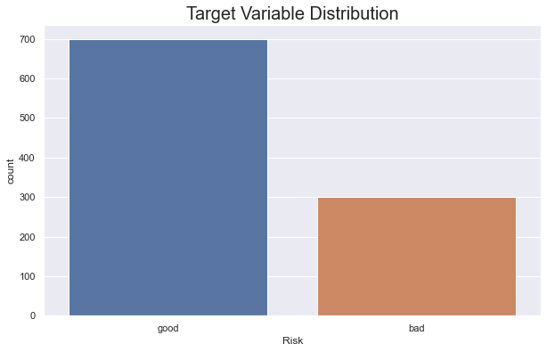
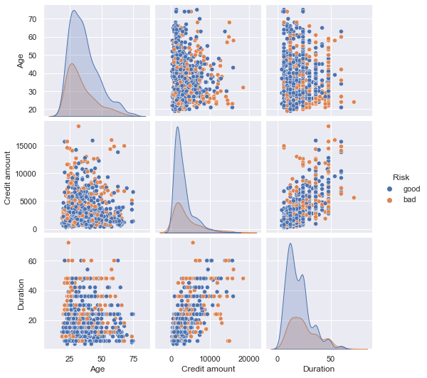
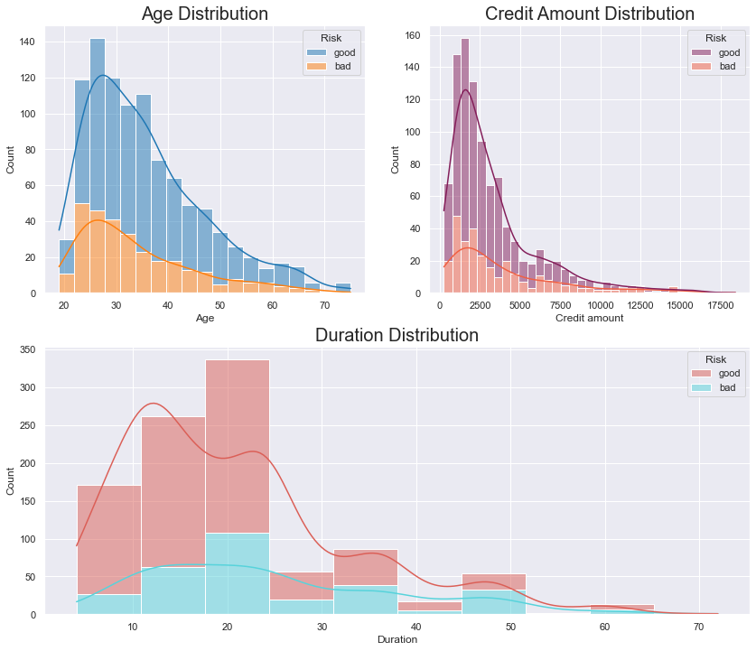
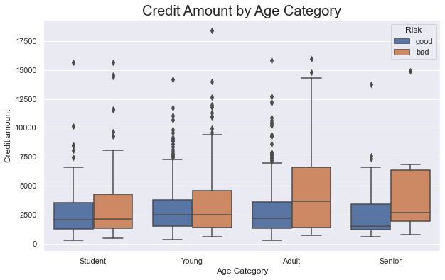
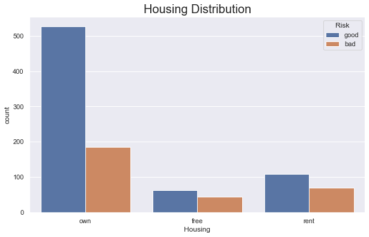
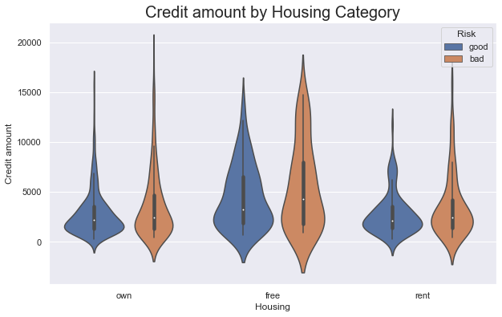
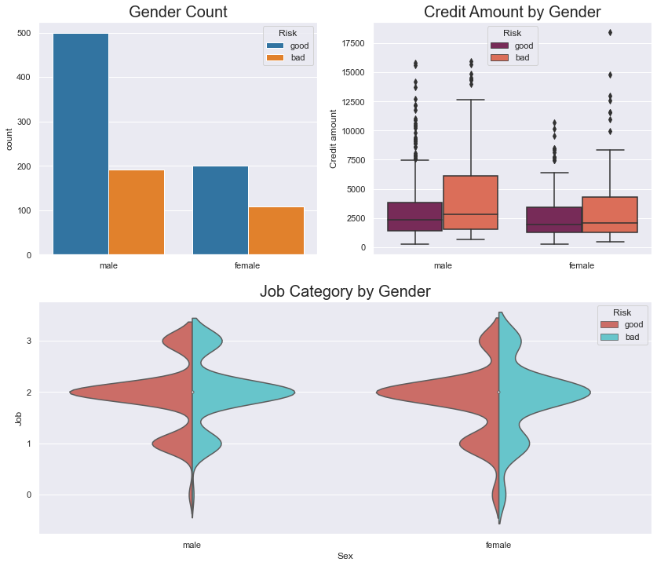
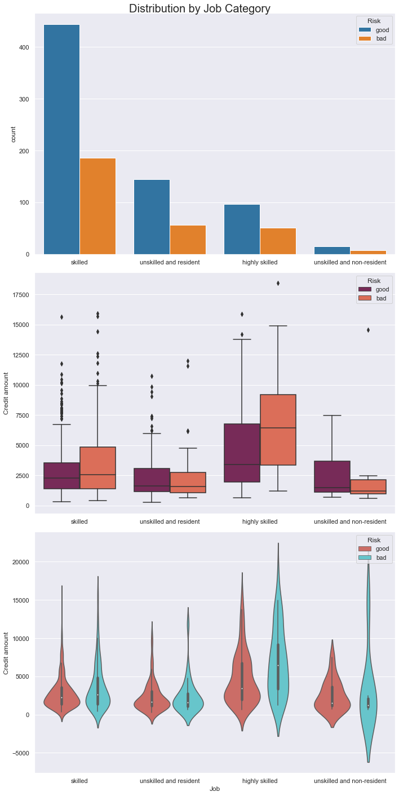
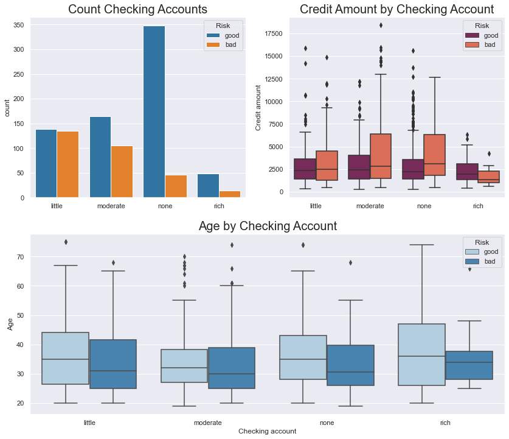

# German Credit Risk Case Study

When a bank receives a loan application the bank has to make a decision regarding whether to go ahead with the loan approval or not. The bank makes a decision on the loan based on the applicant’s profile. Two types of risks are associated with the bank’s decision –
- If the applicant is a good credit risk, i.e. is likely to repay the loan, then not approving the loan to the person results in a loss of business to the bank
- If the applicant is a bad credit risk, i.e. is not likely to repay the loan, then approving the loan to the person results in a financial loss to the bank

## Objective
The objective of the German Credit Data is to minimize the chances of issuing risky loans to applicants while maximizing the chances of profiting from good loans. An applicant’s demographic and socio-economic profiles are considered by loan managers before a decision is taken regarding his/her loan application.
The German Credit data set is a publically available data set downloaded from the UCI Machine Learning Repository. The German Credit Data contains data on 20 variables and the classification of whether an applicant is considered a Good or Bad credit risk for 1000 loan applicants. The task requires exploring the data and building a predictive model to provide a bank manager guidance for making a decision on whether to approve a loan to a prospective applicant based on his/her profile.

## Visual Graphs
### Target Variable Distribution

### Pairplot 

### Distribution of Numerical Values

### Distribution of Credit by Age

### Distribution by Housing

### Credit Amount by Housing

### Distribution by Gender

### Distribution by Job Category

### Saving and Checking Acounts Distribution
Saving | Checking
-------|------
 | 
