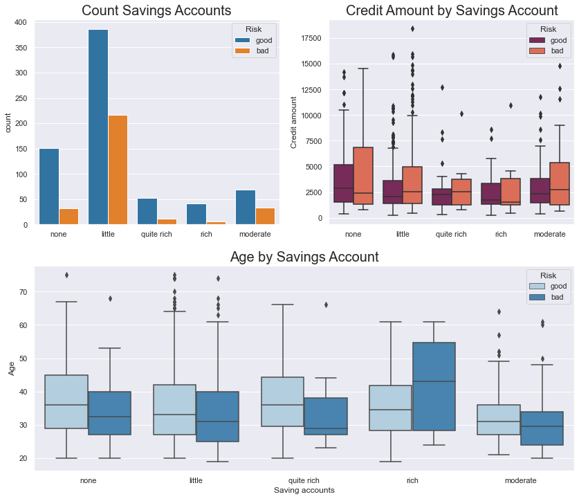
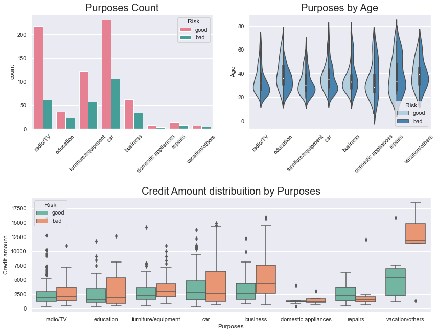
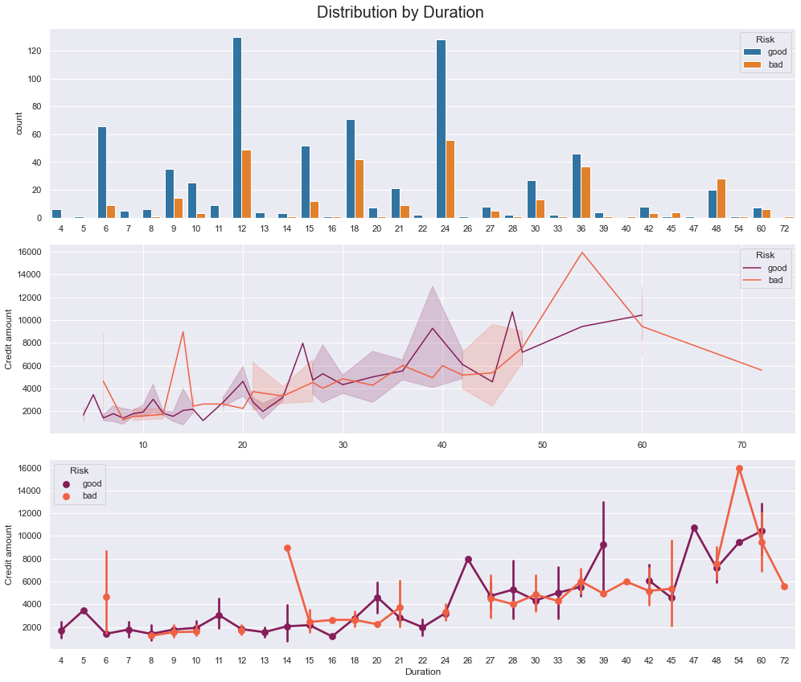

# German Credit Risk Case Study

When a bank receives a loan application the bank has to make a decision regarding whether to go ahead with the loan approval or not. The bank makes a decision on the loan based on the applicant’s profile. Two types of risks are associated with the bank’s decision –
- If the applicant is a good credit risk, i.e. is likely to repay the loan, then not approving the loan to the person results in a loss of business to the bank
- If the applicant is a bad credit risk, i.e. is not likely to repay the loan, then approving the loan to the person results in a financial loss to the bank

## Objective
The objective of the German Credit Data is to minimize the chances of issuing risky loans to applicants while maximizing the chances of profiting from good loans. An applicant’s demographic and socio-economic profiles are considered by loan managers before a decision is taken regarding his/her loan application.
The German Credit data set is a publically available data set downloaded from the UCI Machine Learning Repository. The German Credit Data contains data on 20 variables and the classification of whether an applicant is considered a Good or Bad credit risk for 1000 loan applicants. The task requires exploring the data and building a predictive model to provide a bank manager guidance for making a decision on whether to approve a loan to a prospective applicant based on his/her profile.

## Visual Graphs
### Target Variable Distribution

- There are 700 instances where an applicant was classified as good
- There are 300 instances where an applicant was classified as bad

### Pairplot 

- The distribution plots for Age, Credit amount, and Duration have a positive skew

### Distribution of Numerical Values

- All graphs have a positive skew indicating that the mean is greater than the median
- Applicants between the ages of 20 to 30 are more likely to apply for a loan
- Applicants are less likely to apply for a high credit loan
- More loans have been paid off around 20 months after being issued
- The bank is more likely to receive applicants between the ages of 20 and 30 and request loans between 250 and 2500 DM

### Distribution of Credit by Age

- More than 50% of the applicants with credit amounts below 5,000 DM are classified as **good**
- Adults with loan credit greater than 5,000 DM are more likely to classify as **bad**
- **Students** and **Young** applicants are most likely to apply for loans with a credit amount of less than 5,000 DM

### Distribution by Housing

- Most applicants own a house
- Over half of the applicants who own a house classified as **good**

### Credit Amount by Housing

- The density curves from the violin plot suggest that there is a higher frequency of applicants with credit amounts below 5,000 DM

### Distribution by Gender

- There are 2x more male applicants than females in the data
- The majority of applicants are in the **skilled** job category
- About 2/5 of male applicants and 1/3 of female applicants are classified as **bad**
- The density distribution from the violin plots follows the same trend suggesting that the majority of the male and female applicants are categorized as **skilled** workers

### Distribution by Job Category

- There are 2x more applicants with **skilled** jobs that are classified as **good**
- More than 50% of applicants are under the **skilled** and **unskilled and resident** job categories
- Applicants that are **highly skilled** are more likely to take out larger loans

### Saving and Checking Acounts Distribution
Saving | Checking
-------|------
 | 

- Applicants with **little** or **no** saving accounts are more likely to apply for loans
- The majority of the applicants are in the **little** category
- 50% of the applicants in the **little** category are between the age range of 25 and 45
- Applicants with **moderate**, **quite rich**, and **rich** savings accounts are more likely to be classified as good
- Applicants with **little** and **no** savings accounts with a credit amount loan that exceeds 5,000 DM are more likely to classify as **bad**

- More than 300 hundred applicants had no checking accounts
- More than 3x the applicants that didn’t have checking accounts were classified as **good**
- 50% of the applicants that had **moderate** checking accounts were between the age range of 25 to 40
- There is a larger dispersion of applicants with **rich** checking accounts that are classified as **good** and are between the ages of 25 and 45
- Applicants with a high credit amount and **little** in their checking accounts are more likely to classify as **bad**

### Distribution by Purpose

- A large portion of applicants requested loans for buying cars, **radios/tv’s**
- More than half of the applicants applied for loans less than 5,000 DM
- Applicants with high credit loans are more likely to classify as **bad**

### Distribution by Duration

- Most of the loans issued had a duration of 12 and 24 months
- Most applicants that repaid their loans within 24 months are classified as **good**
- Most applicants with a loan duration that exceeds 24 months are classified as **bad**
